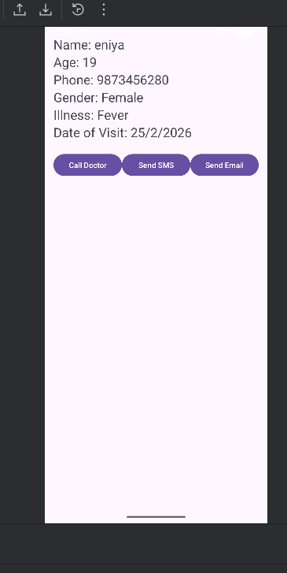

# 📱 Patient Information App – Android Studio Project

## About the Project
The Patient Information App is a simple Android application developed using Android Studio. This application helps to store and display patient details in an organized manner. It demonstrates the use of basic Android UI components and core concepts such as activities, intents, and dialog boxes.

The app allows users to enter patient information, view it on another screen, and perform communication actions such as calling, sending SMS, and sending email with confirmation dialogs.

---

##  Features
- Enter patient details (Name, Age, Phone Number)
- Select gender using Radio Buttons
- Choose illness type using Spinner
- Select appointment date using DatePicker
- Submit and display patient details in another activity
- Call doctor option
- Send SMS option
- Send Email option
- Confirmation DialogBox before call or message actions
- Simple and user-friendly interface

---

## 🛠 Technologies Used
- Java
- XML Layout Design
- Android Studio
- Activities and Intents
- RadioButton
- Spinner
- DatePicker
- CardView / TextView
- AlertDialog (Confirmation Dialog)
- Implicit Intents (Call, SMS, Email)

---

## 📂 Project Structure
- Java Files: `app/src/main/java`
- XML Layout Files: `app/src/main/res/layout`
- AndroidManifest.xml: `app/src/main`

---

## 🎯 Expected Output
- Screen to enter patient details
- Submit button to save and move to next screen
- Display patient information in another activity
- Options to call, send SMS, and send email
- Confirmation dialog before calling or messaging

---

## 💡 Learning Outcome
This project helps in understanding:
- Android UI design
- Activity navigation using Intents
- Using Spinner, RadioButton, DatePicker
- Passing data between activities
- Implementing communication features
- Creating confirmation dialog boxes

---

## 👩‍💻 Developed By
Register Number: 732923ITR028

## 📸 App Screenshot

